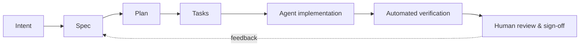

# AI-Native Software Engineering & Specification-Driven Development

Code implementation is no longer the main bottleneck in software delivery. The engineer's role shifts from manual coder to **strategic curator, specification author, and system verifier**.

## Course goal

Teach students to turn human intent into verifiable artifacts, configure AI developer environments, manage context boundaries, and run automated quality gates across the full SDLC.

## Course at a glance

| Module | Focus | Hands-on work |
| --- | --- | --- |
| [1. Foundations & agent architecture](modules/module-1.md) | How agents work in the terminal and IDE; context windows; guardrails | Set up an AI coding environment, write a project constitution |
| [2. Specification-driven development](modules/module-2.md) | From "vibe coding" to structured, intent-driven generation | Build a feature by refining specs only |
| [3. Multi-agent orchestration & verification](modules/module-3.md) | Specialized agent roles; automated verification pipelines | Continuous evals and quality gates in CI |
| [4. Cognitive debt, review & governance](modules/module-4.md) | Keeping human understanding; agentic review; AI security | Capstone project |

## How students are graded

Grading weights the process and the artifacts students produce (specs, plans, tests, agent logs) over raw code volume. See [Assessment](assessment.md).
