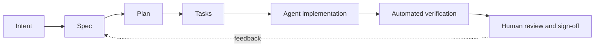

# AI-Native Software Engineering & Specification-Driven Development

A four-module university course on building software with AI coding agents: how the agents work, how to direct them with specifications, how to verify what they produce, and how to keep human understanding and accountability.

## Course goals

Students who complete the course can:

1. Explain how coding agents work (the agent loop, tools, context files, MCP) and configure one for a real project.
2. Turn intent into testable specifications (EARS, Spec Kit, OpenSpec) and drive implementation from them.
3. Build automated verification around agent output: end-to-end tests, static and secret scanning, and evals in CI.
4. Keep a team's understanding of its system as AI writes more of the code, using review gates, ADRs, and AI-use logs.
5. Recognize and reduce the main AI-specific security risks (prompt injection, the lethal trifecta, package hallucination).
6. Read the evidence on AI productivity and code quality critically, separating measured results from vendor claims.

## Why this course

Adoption is near universal, but the evidence on outcomes is mixed. The [DORA 2025 report](https://cloud.google.com/blog/products/ai-machine-learning/announcing-the-2025-dora-report) found 90% AI adoption, with AI associated with higher throughput and lower delivery stability. In [METR's 2025 trial](https://metr.org/blog/2025-07-10-early-2025-ai-experienced-os-dev-study/), experienced developers took 19% longer with AI while believing they were faster. The course's response is to treat specifications, tests, and review as the engineer's main work when agents write much of the code.

!!! note "Course framing"
    The course describes a shift from a sequential SDLC to an agent-orchestrated SDLC. This is the course's own framing, not a model defined by a standards body.

## Course at a glance

| Module | Focus | Lab | Key tools |
| --- | --- | --- | --- |
| [1. Foundations and agent architecture](modules/module-1.md) | Agent loop, context files, context rot, MCP, adoption data | Install an agent, write a portable `AGENTS.md`, build and connect an MCP server | Claude Code or Gemini CLI, MCP Python SDK |
| [2. Specification-driven development](modules/module-2.md) | EARS, Spec Kit workflow, OpenSpec delta specs, critiques of SDD | Build a feature by editing specs only, then make a brownfield change | Spec Kit v1.1.2, OpenSpec 1.14.1 |
| [3. Multi-agent orchestration and verification](modules/module-3.md) | BMAD roles, subagents, e2e tests from acceptance criteria, static gates, evals | Reviewer subagent, Playwright test agents, eval suite in GitHub Actions | Playwright, Ruff, Semgrep, gitleaks, promptfoo |
| [4. Cognitive debt, review and governance](modules/module-4.md) | Cognitive debt, skill formation, AI code review, prompt injection, governance, ADRs | Threat-model your agent setup; capstone | ADRs (Nygard, MADR) |

## Prerequisites

- **Programming:** comfortable in Python or JavaScript/TypeScript, Git, and the command line.
- **Software engineering:** basic testing and code review experience (for example, a prior software engineering course).
- **Accounts:** a GitHub account (for Actions and pull requests).

## Tools and cost

| Tool | Needed for | Cost (as of October 2026) |
| --- | --- | --- |
| Claude Code | Modules 1–4 (Claude track) | Requires a Pro, Max, Team, Enterprise, or Console account; "The free claude.ai plan does not include Claude Code access." ([setup docs](https://code.claude.com/docs/en/setup)) |
| Gemini CLI | Modules 1–4 (no-cost track) | Free tier through Google sign-in: 60 requests/min, 1,000 requests/day. ([README](https://github.com/google-gemini/gemini-cli)) |
| Python 3.11+ and uv | Spec Kit | Free ([Spec Kit README](https://github.com/github/spec-kit)) |
| Node.js 20.19.0+ | OpenSpec | Free ([OpenSpec README](https://github.com/Fission-AI/OpenSpec)) |
| Node.js ≥22.22.0 | promptfoo GitHub Action | Free tool; model API calls may cost money ([promptfoo docs](https://www.promptfoo.dev/docs/integrations/github-action/)) |
| Playwright, Ruff, Semgrep, gitleaks | Module 3 | Open source |

!!! tip "No-cost path"
    Students without a paid Claude plan can complete every lab with **Gemini CLI** on its free tier. Spec Kit supports `--integration gemini`, and OpenSpec supports many assistants. Each lab marks the steps that differ. Two gaps: Claude Code subagents and Playwright's `init-agents` do not list Gemini CLI, so the Module 3 lab gives a manual alternative; and running evals in CI calls a model API, whose free options were not verified for this course. Cursor's free tier was also not verified.

## How to use this site

- **Students:** work through the modules in order. Each module page has learning objectives, lecture topics with linked sources, required readings, a lab with copy-pasteable steps, deliverables, and discussion questions.
- **Instructors:** the [Assessment](assessment.md) page gives weights, the oral defense format, and an AI-use policy. [Sources](sources.md) lists every reference by module and has a **Verify before teaching** list of facts the research flagged as unconfirmed. [Real courses](resources/real-courses.md) lists comparable university courses.
- **Version notes:** each module has a version note. The tools change monthly or faster; check the version note and the linked docs before each term.
- **Claims and links:** every factual claim links to its source. Statements marked "course framing," "course synthesis," or "course-authored" are this course's own design, not findings from a source.
