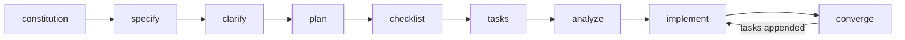

# Module 2: Specification-driven development (SDD)

!!! abstract "Core focus"
    Moving from ad-hoc prompting ("vibe coding") to structured, specification-driven generation: writing testable requirements, running the GitHub Spec Kit workflow on a greenfield feature, and managing brownfield change with OpenSpec delta specs.

!!! warning "Version note (as of October 2026)"
    Checked October 8, 2026. Spec Kit's latest release was **v1.1.2 (October 7, 2026)** and it ships several releases a week; pin the lab to `v1.1.2` so behavior does not change mid-term. OpenSpec's npm `latest` was **1.14.1** (October 5, 2026). `/speckit.converge` was added in v0.11.2 (June 18, 2026), so tutorials written before mid-2026 will not mention it. ([Spec Kit CHANGELOG](https://github.com/github/spec-kit/blob/main/CHANGELOG.md); [OpenSpec on npm](https://registry.npmjs.org/@fission-ai/openspec))

## Learning objectives

By the end of this module, students can:

1. Write requirements in the five EARS patterns and turn them into GIVEN/WHEN/THEN scenarios.
2. Run the Spec Kit workflow from constitution to convergence and explain what each command reads and writes.
3. Explain why command names differ between agents and find the right form for their own agent.
4. Write an OpenSpec change with ADDED/MODIFIED/REMOVED delta specs and archive it.
5. Compare Spec Kit, OpenSpec, Kiro, Tessl, and BMAD along the spec lifecycle.
6. State the main critiques of SDD and judge when a full SDD workflow is too heavy.

## Lecture topics

### 1. From requirements to testable sentences: EARS

- **Origin.** EARS (Easy Approach to Requirements Syntax) was developed by Alistair Mavin and colleagues at Rolls-Royce plc "whilst analysing the airworthiness regulations for a jet engine's control system," first published in 2009. ([alistairmavin.com/ears](https://alistairmavin.com/ears/)) Paper: A. Mavin, P. Wilkinson, A. Harwood, M. Novak, "Easy Approach to Requirements Syntax (EARS)," RE'09, Atlanta, pp. 317–322. ([IEEE Xplore](https://ieeexplore.ieee.org/document/5328509); IEEE document number to verify)
- **Generic syntax:** "While <optional pre-condition>, when <optional trigger>, the <system name> shall <system response>." Zero or more preconditions, zero or one trigger, one system name, one or more responses. ([alistairmavin.com/ears](https://alistairmavin.com/ears/))

| Pattern | Keyword | Template (quoted) |
| --- | --- | --- |
| Ubiquitous | — | The <system name> shall <system response> |
| State-driven | While | While <precondition(s)>, the <system name> shall <system response> |
| Event-driven | When | When <trigger>, the <system name> shall <system response> |
| Optional feature | Where | Where <feature is included>, the <system name> shall <system response> |
| Unwanted behaviour | If/Then | If <trigger>, then the <system name> shall <system response> |
| Complex | While + When | While <precondition(s)>, When <trigger>, the <system name> shall <system response> |

Source: [alistairmavin.com/ears](https://alistairmavin.com/ears/)

Teaching split (course synthesis): EARS is the "requirement sentence" layer; GIVEN/WHEN/THEN scenarios (OpenSpec) or acceptance criteria (Spec Kit) are the "example and test" layer. Kiro writes EARS directly into `requirements.md` using a `WHEN [condition/event] THE SYSTEM SHALL [expected behavior]` form ([Kiro feature specs](https://kiro.dev/docs/specs/feature-specs/); exact wording to verify on the page).

### 2. Greenfield SDD with GitHub Spec Kit

- **Origin.** Announced in "Spec-driven development with AI: Get started with a new open source toolkit" by Den Delimarsky, September 2, 2025, with four phases: Specify, Plan, Tasks, Implement. ([GitHub Blog](https://github.blog/ai-and-ml/generative-ai/spec-driven-development-with-ai-get-started-with-a-new-open-source-toolkit/))
- **Prerequisites:** "Python 3.11+, uv, and a supported AI coding agent on Linux, macOS, or Windows." ([README](https://github.com/github/spec-kit)) Officially supported agents on the install page include Claude Code, GitHub Copilot, and Gemini CLI. ([Installation guide](https://github.github.io/spec-kit/installation.html))
- **Artifacts:** a constitution, then per feature `spec.md`, `plan.md`, `tasks.md`, and checklists. Spec Kit's methodology talks about "intent-driven development," but it defines **no `intent.md` file**. ([spec-driven.md](https://github.com/github/spec-kit/blob/main/spec-driven.md))

**The ten core commands** (reference notation, from the [Agentic SDD reference](https://github.github.io/spec-kit/reference/agentic-sdd.html)):

| Command | Purpose (quoted) |
| --- | --- |
| `/speckit.constitution` | Establish or update project principles |
| `/speckit.specify` | Define requirements and user stories |
| `/speckit.clarify` | Resolve ambiguity before planning (optional quality gate; formerly /quizme) |
| `/speckit.plan` | Create the technical implementation plan |
| `/speckit.checklist` | Generate requirements-quality checklists (optional quality gate) |
| `/speckit.tasks` | Break the plan into actionable tasks |
| `/speckit.analyze` | Check artifact consistency after tasks and before implementation (optional quality gate) |
| `/speckit.implement` | Execute the tasks |
| `/speckit.converge` | Assess implementation against the artifacts and append remaining work |
| `/speckit.taskstoissues` | Optionally convert tasks into GitHub issues |

Canonical order: `/speckit.constitution -> /speckit.specify -> /speckit.clarify -> /speckit.plan -> /speckit.checklist -> /speckit.tasks -> /speckit.analyze -> /speckit.implement -> /speckit.converge`. ([Agentic SDD reference](https://github.github.io/spec-kit/reference/agentic-sdd.html))



!!! info "Why the command names look different in your agent"
    The docs write commands as `/speckit.<name>`, but these are agent skills, not terminal commands. How you type them depends on the integration: "GitHub Copilot's default skills mode uses /speckit-*; some other agents use $speckit-* (e.g. Codex, ZCode) or /skill:speckit-* (e.g. Kimi)." ([Agentic SDD reference](https://github.github.io/spec-kit/reference/agentic-sdd.html)) The README examples use the hyphen form. Bare names like `/specify` or `/constitution` come from older tutorials and are not the current form. Check the "Command invocation" table for your agent before the lab.

Key behaviors:

- **`/speckit.clarify`** "asks up to five targeted questions about underspecified areas of the current spec and encodes your answers back into spec.md."
- **`/speckit.checklist`** produces "unit tests for your requirements": it checks whether the spec "is complete, clear, unambiguous, and consistent." Checklists are "reviewer-owned," and `[x]` "does not mean implementation work is complete." `/speckit.implement` "asks before proceeding when any are unchecked."
- **`/speckit.analyze`** is "read-only cross-artifact consistency and quality analysis across spec.md, plan.md, and tasks.md ... It never edits files."
- **`/speckit.converge`** "assesses the codebase against the feature's spec, plan, and tasks to confirm nothing was missed. It is append-only: it never edits or deletes code, and its only possible write is adding tasks to tasks.md." If it finds gaps it appends tasks under a Convergence section; run `/speckit.implement` again and repeat until it reports Converged.
- **`/speckit.taskstoissues`** was deprecated as a core command in v1.1.0 in favor of a bundled `github` extension. ([Releases](https://github.com/github/spec-kit/releases))

All quotes above: [Agentic SDD reference](https://github.github.io/spec-kit/reference/agentic-sdd.html).

### 3. Brownfield change: OpenSpec delta specs

- **What it is.** "Spec-driven development (SDD) for AI coding assistants," described as brownfield-ready, tool-agnostic (30+ assistants), and plain Markdown. ([OpenSpec README](https://github.com/Fission-AI/OpenSpec))
- **Layout.** `openspec/specs/` holds the current source of truth. Each change lives in `openspec/changes/<name>/` with `proposal.md`, `specs/` (deltas), `design.md`, and `tasks.md`. Completed changes move to `openspec/changes/archive/`. ([README](https://github.com/Fission-AI/OpenSpec))
- **Commands (OPSX form).** Default profile: `/opsx:propose`, `/opsx:explore`, `/opsx:apply`, `/opsx:update`, `/opsx:sync`, `/opsx:archive`. ([docs/commands.md](https://github.com/Fission-AI/OpenSpec/blob/main/docs/commands.md)) The legacy `/openspec:proposal`, `/openspec:apply`, and `/openspec:archive` map to `/opsx:propose`, `/opsx:apply`, and `/opsx:archive`. ([migration guide](https://github.com/Fission-AI/OpenSpec/blob/main/docs/migration-guide.md)) Spelling varies by tool: "your tool may spell it `/opsx-propose` (Cursor, GitHub Copilot), `@opsx-propose` (Amazon Q) or `$openspec-propose` (Codex)." ([README](https://github.com/Fission-AI/OpenSpec))
- **Delta specs.** A change describes only what is different, in three sections. On archive: ADDED is "Appended to main spec"; MODIFIED "Replaces existing requirement"; REMOVED is "Deleted from main spec." ([docs/concepts.md](https://github.com/Fission-AI/OpenSpec/blob/main/docs/concepts.md)) Example from the docs:

```markdown
## ADDED Requirements
### Requirement: Two-Factor Authentication
The system MUST support TOTP-based two-factor authentication.
#### Scenario: 2FA enrollment
- GIVEN a user without 2FA enabled
- WHEN the user enables 2FA in settings
- THEN a QR code is displayed for authenticator app setup
## MODIFIED Requirements
### Requirement: Session Expiration
The system MUST expire sessions after 15 minutes of inactivity.
(Previously: 30 minutes)
## REMOVED Requirements
### Requirement: Remember Me
(Deprecated in favor of 2FA. Users should re-authenticate each session.)
```

- **Why deltas.** The docs list clarity, conflict avoidance, review efficiency, and "Brownfield fit. Most work modifies existing behavior. Deltas make modifications first-class." Writing rules: "One statement, one `SHALL`/`MUST`," and requirements must be "Observable." ([concepts](https://github.com/Fission-AI/OpenSpec/blob/main/docs/concepts.md); [writing-specs](https://github.com/Fission-AI/OpenSpec/blob/main/docs/writing-specs.md))
- **CI check.** `openspec validate <change> --strict`; since 1.14.1, a requirement over 500 characters is a warning and fails strict mode. ([CHANGELOG](https://github.com/Fission-AI/OpenSpec/blob/main/CHANGELOG.md))
- **Spec Kit's brownfield answer is different.** Spec Kit offers persistence models rather than a merge mechanism: flow-forward (a new feature directory per change), living spec (spec.md is the contract; plan and tasks are regenerated), and flow-back (discoveries flow back and are reconciled with `/speckit.analyze`). ([Evolving specs](https://github.github.io/spec-kit/guides/evolving-specs.html)) Its brownfield guide warns: "The new spec.md defines the change you intend to make, not a retroactive specification of every existing behavior." ([Existing projects](https://github.github.io/spec-kit/guides/existing-projects.html))

!!! note "About `intent.md`"
    `intent.md` is not an artifact in Spec Kit, OpenSpec, or Kiro. It is the canonical file of **IntentSpec**, an MIT-licensed "open format for product intent" stewarded by Pathmode, with sections for objective, outcomes, constraints, edge cases, and verification. An adapter (`pathmode-intent`) feeds `intent.md` into OpenSpec. ([pathmodeio/intentspec](https://github.com/pathmodeio/intentspec)) If you use an intent document in this course, treat it as an optional upstream product-intent file, not part of Spec Kit.

### 4. The wider tool landscape

| Tool | Distinctive idea | Source |
| --- | --- | --- |
| Kiro (AWS) | Three files: `requirements.md` (or `bugfix.md`), `design.md`, `tasks.md`; EARS requirements; Requirements-First, Design-First, Quick Spec, and Bugfix spec types | [Kiro specs](https://kiro.dev/docs/specs/) |
| Spec Kit | Agent-agnostic; constitution plus optional quality gates; implement/converge loop | [Agentic SDD reference](https://github.github.io/spec-kit/reference/agentic-sdd.html) |
| OpenSpec | Delta specs merged on archive; built for brownfield | [README](https://github.com/Fission-AI/OpenSpec) |
| Tessl | Classified by Böckeler as aiming for "spec-as-source" | [martinfowler.com](https://martinfowler.com/articles/exploring-gen-ai/sdd-3-tools.html) |
| BMAD | Agent-persona agile framework (covered in Module 3) | [BMAD-METHOD](https://github.com/bmad-code-org/BMAD-METHOD) |

### 5. Critiques and limits of SDD

- **Böckeler's taxonomy.** In "Understanding Spec-Driven-Development: Kiro, spec-kit, and Tessl" (Birgitta Böckeler, martinfowler.com, October 15, 2025), SDD comes in three levels: *spec-first* (written first, discarded after the task), *spec-anchored* (kept and evolved with the feature), and *spec-as-source* (humans edit only the spec). ([martinfowler.com](https://martinfowler.com/articles/exploring-gen-ai/sdd-3-tools.html))
- **Her critiques** (paraphrased; check exact quotes against the article before putting them on slides):
    - Workflow size mismatch: fixing a small bug in Kiro produced 4 user stories and 16 acceptance criteria.
    - Review overhead: she would rather review code than many Markdown files.
    - Larger context windows do not mean the agent picks up everything; agents ignored some instructions and over-applied others.
    - The line between functional and technical content in specs is unclear.
    - Spec-as-source risks combining inflexibility and non-determinism, as model-driven development did.
- **Thoughtworks Technology Radar** placed "Spec-driven development" in **Assess** (November 5, 2025): "We may be relearning a bitter lesson — that handcrafting detailed rules for AI ultimately doesn't scale." The page notes the blip is not on the current edition. ([Thoughtworks Radar](https://www.thoughtworks.com/radar/techniques/spec-driven-development))
- **Tool response.** Böckeler wrote before converge, extensions, and the brownfield guides existed. Spec Kit now makes clarify, checklist, and analyze optional and offers a "Shorter path — for smaller features." ([Quickstart](https://github.github.io/spec-kit/quickstart.html)) Her points on review overhead and agent reliability still apply.

## Required readings

| Title | Author / org | Date | Link |
| --- | --- | --- | --- |
| Spec-driven development with AI: Get started with a new open source toolkit | Den Delimarsky (GitHub) | September 2, 2025 | <https://github.blog/ai-and-ml/generative-ai/spec-driven-development-with-ai-get-started-with-a-new-open-source-toolkit/> |
| Spec Kit Agentic SDD reference | GitHub | accessed October 8, 2026 | <https://github.github.io/spec-kit/reference/agentic-sdd.html> |
| Spec Kit: Evolving specs | GitHub | accessed October 8, 2026 | <https://github.github.io/spec-kit/guides/evolving-specs.html> |
| OpenSpec concepts | Fission-AI | accessed October 8, 2026 | <https://github.com/Fission-AI/OpenSpec/blob/main/docs/concepts.md> |
| EARS | Alistair Mavin | accessed October 8, 2026 | <https://alistairmavin.com/ears/> |
| Understanding Spec-Driven-Development: Kiro, spec-kit, and Tessl | Birgitta Böckeler (martinfowler.com) | October 15, 2025 | <https://martinfowler.com/articles/exploring-gen-ai/sdd-3-tools.html> |
| Technology Radar: Spec-driven development | Thoughtworks | November 5, 2025 | <https://www.thoughtworks.com/radar/techniques/spec-driven-development> |

## Hands-on lab: build a feature by editing specs only

**Goal:** build the Spec Kit quickstart's "Taskify" app (or an instructor-chosen feature) without hand-editing code, then make a brownfield change with OpenSpec.

**Lab rule (course constraint, not a Spec Kit feature):** you may edit only the constitution, `spec.md`, `plan.md`, and checklist files. All code changes must come from `/speckit.implement` and `/speckit.converge`. Your git history is the evidence.

!!! tip "No-cost path"
    Spec Kit supports Gemini CLI as an integration (`--integration gemini`), so the whole lab runs on Gemini CLI's free tier. Claude Code users pass `--integration claude`.

### Part A: Spec Kit (greenfield)

1. Install the pinned Spec Kit CLI and confirm the version ([Installation guide](https://github.github.io/spec-kit/installation.html)):

    ```bash
    uv tool install specify-cli --from git+https://github.com/github/spec-kit.git@v1.1.2
    specify version
    ```

2. Create the project ([Quickstart](https://github.github.io/spec-kit/quickstart.html)). Pick your agent:

    ```bash
    specify init taskify --integration claude
    cd taskify
    ```

    For Gemini CLI use `--integration gemini`. Non-interactive runs default to GitHub Copilot unless you pass `--integration`.

3. Optional, for numbered feature branches:

    ```bash
    specify extension add git
    ```

4. Start your agent in the `taskify` folder. The prompts below use the hyphen form from the quickstart; use whatever form your agent's invocation table shows. Write the constitution:

    ```text
    /speckit-constitution Taskify is a "Security-First" application. All user inputs must be validated.
    ```

    Add your own principles (testing standard, accessibility, performance).

5. Write the specification:

    ```text
    /speckit-specify Develop Taskify, a team productivity platform where predefined users create projects, assign tasks, comment, and move tasks across Kanban columns (To Do, In Progress, In Review, Done).
    ```

6. Before clarifying, rewrite at least five requirements in `spec.md` using EARS patterns, including at least one unwanted-behaviour (If/Then) requirement.

7. Clarify (up to five questions per run; repeat as needed):

    ```text
    /speckit-clarify Focus on task card behavior — status changes, comment permissions, and user assignment.
    ```

8. Plan, giving your stack, architecture, and constraints:

    ```text
    /speckit-plan <stack, architecture, constraints>
    ```

9. Generate the requirements checklist, then review it yourself and mark items `[x]`:

    ```text
    /speckit-checklist
    ```

10. Generate tasks (phases: Setup, Foundational, one per user story, Polish):

    ```text
    /speckit-tasks
    ```

11. Check consistency. If it reports issues, fix them at the source (spec, plan, or tasks) and rerun until clean:

    ```text
    /speckit-analyze
    ```

12. Implement. For a large feature, scope it, for example "Implement only the Setup and Foundational phases":

    ```text
    /speckit-implement
    ```

13. Converge. Repeat implement and converge until it reports Converged. Count the passes:

    ```text
    /speckit-converge
    ```

14. Change request (living-spec model): the instructor issues a change. Edit `spec.md` (or run `/speckit-clarify`), then rerun plan, tasks, analyze, implement, and converge. ([Evolving specs](https://github.github.io/spec-kit/guides/evolving-specs.html))

Agent output varies between runs, so the number of converge passes is not predictable. That is expected.

### Part B: OpenSpec (brownfield)

1. Install OpenSpec (requires Node.js 20.19.0 or higher) and initialize it in your Taskify repo ([README](https://github.com/Fission-AI/OpenSpec)):

    ```bash
    npm install -g @fission-ai/openspec@latest
    openspec init
    ```

    To pin the version used in this course, replace `@latest` with `@1.14.1`.

2. In your agent, propose a change (for example, "tasks have an optional due date and overdue tasks are highlighted"):

    ```text
    /opsx:propose
    ```

3. Edit the generated delta spec so it has at least one ADDED and one MODIFIED requirement, each with one `SHALL`/`MUST` and a GIVEN/WHEN/THEN scenario. Validate:

    ```bash
    openspec validate <change> --strict
    ```

4. Apply, then archive, and inspect how `openspec/specs/` changed:

    ```text
    /opsx:apply
    /opsx:archive
    ```

## Deliverables

1. Git repository with the Spec Kit artifacts, showing (through the commit diffs) that you edited only spec-level files.
2. The `/speckit-analyze` reports, your reviewed checklist, and a log of converge passes (how many, what each found).
3. A table of your EARS requirements with the pattern each uses.
4. The archived OpenSpec change and a diff of `openspec/specs/` before and after archive.
5. A 500-word comparison: Spec Kit persistence models vs. OpenSpec deltas for this change. Which would you use on a team, and why?

## Discussion questions

1. Böckeler found a small bug fix produced 4 user stories and 16 acceptance criteria. Where is the threshold below which SDD costs more than it saves? Use your own lab data.
2. `/speckit.converge` is append-only and never edits code. Why might that design be safer than an agent that "fixes until done"?
3. A checked `[x]` in a Spec Kit checklist "does not mean implementation work is complete." What does it mean, and who should be allowed to check it?
4. Spec-first, spec-anchored, spec-as-source: which did your lab end up being in practice? Would spec-as-source work for your project?
5. Thoughtworks warned that handcrafting detailed rules for AI "ultimately doesn't scale." What part of your spec would still be valuable if models became much better?
