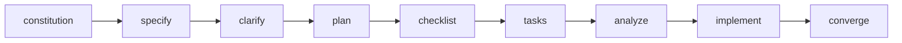

# Module 2: Specification-driven development (SDD) & executable intent

!!! abstract "Core focus"
    Moving from ad-hoc "vibe coding" to structured, intent-driven software generation.

## Lecture topics

1. **From requirements to executable specs.** Expressing constraints with EARS (Easy Approach to Requirements Syntax) and structured Markdown artifacts: `intent.md`, `spec.md`, `plan.md`, `tasks.md`.
2. **Greenfield development with GitHub Spec Kit.** Running the full command loop: `/constitution`, `/specify`, `/clarify`, `/plan`, `/checklist`, `/tasks`, `/analyze`, `/implement`, `/converge`.
3. **Brownfield change management.** Handling existing enterprise codebases with delta specifications and change proposals (for example OpenSpec).

## Hands-on lab: building features without manual coding

- Build a full-stack CLI or web feature only by refining specifications and guiding agent task lists.
- Run convergence loops (`/converge`) to catch missing edge cases before code integration.
